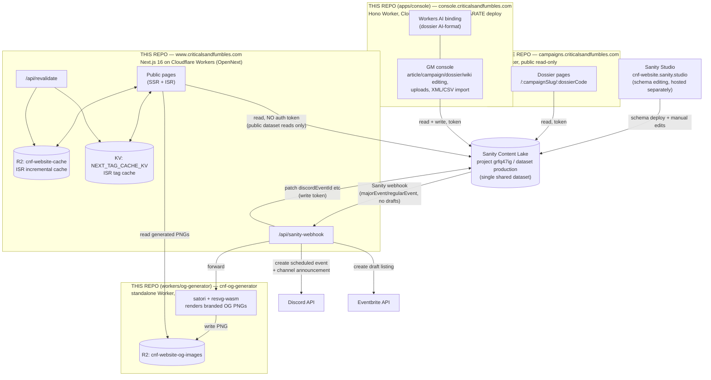

# criticalsandfumbles.com

Next.js (App Router) site for Criticals & Fumbles, backed by Sanity CMS
and deployed as a Cloudflare Worker via `@opennextjs/cloudflare`. A
recruitment funnel first — see `CLAUDE.md` "Site purpose" for the
product framing before making priority calls.

**Live:** https://www.criticalsandfumbles.com
**Studio:** https://cnf-website.sanity.studio (hosted separately, not
part of this app's bundle)

Full project context (schema conventions, design system, deploy
history, lessons learned) lives in `CLAUDE.md` and the `docs/*.md`
modules it indexes — read those before making non-trivial changes,
especially anything touching a Sanity schema.

## Tech stack (this app)

| Layer | Choice |
|---|---|
| Framework | Next.js 16.3 (App Router, TypeScript, no `src/` directory) |
| UI | React 19.2, Tailwind CSS v4 (CSS-variable theme), `@portabletext/react` for Sanity rich text |
| CMS | Sanity v6 (`next-sanity` client) — Studio hosted separately, never bundled into this app |
| Hosting | Cloudflare Workers, via `@opennextjs/cloudflare` (not Vercel, not Cloudflare Pages) |
| Caching | ISR backed by Cloudflare R2 (`cnf-website-cache`) + KV tag cache (`NEXT_TAG_CACHE_KV`) for on-demand invalidation |
| Runtime pins | Node 20 LTS, Wrangler `4.86.0`, `@sanity/cli` `7.2.3` — all three pinned because every version past these requires Node ≥22 (see `docs/seo-and-infra.md`) |
| CI | GitHub Actions, used only for scheduled jobs (`sanity-backup.yml`, `dotted-id-audit.yml`) — deploys themselves go through Cloudflare's git-integrated Workers Builds, not Actions |

See `docs/seo-and-infra.md` for the full detail (bundle-size budget,
env vars, pinned-version rationale).

## Architecture — the whole system

`criticalsandfumbles.com` isn't one app — it's four independently
deployed Cloudflare Workers plus Sanity Studio, all sharing a single
Sanity project/dataset (`grfq47ig` / `production`) as the one source of
truth. Two of the four live in *this* repo (this Next.js app, and
`apps/console`); `workers/og-generator` also lives in this repo but
deploys as its own separate Worker; the `campaigns` subsite is a fully
separate GitHub repo.



**Why split this way** — each piece exists to stay inside Cloudflare
Workers' free-tier 3 MiB gzip bundle limit, which a single app
couldn't hit while also embedding Sanity Studio (~21 MB) or
`next/og`'s WASM renderer (doubled the main bundle). See
`docs/seo-and-infra.md` → "Known Risks → Bundle size" and "OG image
generation" for the incidents that produced this shape.

| Piece | Where it lives | Deploys as | Reads/writes Sanity |
|---|---|---|---|
| Main site | this repo, root | Cloudflare Worker `cnf-sg` (`npm run deploy`) | Reads only, **no auth token** (public dataset) |
| GM console | this repo, `apps/console/` | Cloudflare Worker `console` (`cd apps/console && npm run deploy`) | Reads + writes, token-authenticated |
| OG image generator | this repo, `workers/og-generator/` | Cloudflare Worker `cnf-og-generator` (`cd workers/og-generator && npm run deploy`) | No Sanity access — receives data via webhook forward, writes only to its own R2 bucket |
| Campaigns subsite | **separate repo** (`campaigns`) | Cloudflare Worker `campaigns` (`npm run deploy` in that repo) | Reads, token-authenticated |

All four are independent deploys — there is no single "deploy
everything" command, and a push to this repo's `main` does **not**
redeploy `apps/console`, `workers/og-generator`, or the `campaigns`
repo.

## Local setup

1. `npm install`
2. Copy `.env.local.example` to `.env.local` and fill in real values
   (Sanity project ID/dataset/tokens — ask a project maintainer, or see
   `docs/seo-and-infra.md` "Environment variables" for what each one
   does).
3. `npm run dev` — starts the Next.js dev server at
   [http://localhost:3000](http://localhost:3000).

Sanity Studio is a separate local process, not part of this app:
`npm run studio` (reads `sanity.config.ts`/`sanity.cli.ts`).

## Build, preview, and deploy (Cloudflare, not Vercel)

This project does **not** deploy to Vercel — despite what `next build`
guides elsewhere assume, production is a Cloudflare Worker built via
OpenNext. See `docs/seo-and-infra.md` "Cloudflare deployment" for the
full detail (bundle size budget, R2 buckets, env var panels, etc.); the
short version:

```bash
# Build the OpenNext/Cloudflare output
npm run build:cloudflare

# Deploy to production (builds first automatically — see below)
npm run deploy

# Preview a branch without touching production (build first, then):
npx wrangler versions upload --preview-alias <name>
```

`npm run deploy` runs `build:cloudflare` before deploying, so it always
ships current source — there's no way to accidentally redeploy stale
output through the normal script. If you genuinely need to deploy
already-built `.open-next` output as-is (rare), use `npm run
deploy:prebuilt` instead — a separate, deliberately-named script so
skipping the build is never the default.

After any deploy that touches R2/OG-image config, run `npm run
verify:og-default` to confirm the default OG image is actually being
served (see `docs/seo-and-infra.md`).

## Sanity Studio deploy

Studio is hosted separately from the app (see "Stack" in `CLAUDE.md` for
why) and deployed with its own command:

```bash
npm run studio:deploy
```

Run this after any change to `sanity/schemas/*.ts`.

## Docs index

Start with `CLAUDE.md`, then read only the module(s) relevant to your
task:

| Module | Read this when... |
|---|---|
| `docs/schemas.md` | Creating or modifying any Sanity schema, adding enum options, checking what document types exist |
| `docs/wiki-architecture.md` | Working on `worldUnit`, `keyFigure`, stat blocks, wiki pages/routes, or the four worlds |
| `docs/components.md` | Building or editing React components, page routing conventions, the Hero panel, or adding a new page |
| `docs/design-system.md` | Working on colours, typography, CSS tokens, dark/light mode, or brand voice/values content |
| `docs/seo-and-infra.md` | Working on metadata, OG images, domain/env config, R2 usage, Cloudflare deployment, or bundle-size history |
| `docs/migrations.md` | Writing or running a Sanity migration or seed script |
| `docs/lessons-learned.md` | Before any schema rename/restructure, or when debugging "content not appearing" issues |
| `docs/release-history.md` | Reference only — rarely needed. Also holds open TODOs/follow-ups |

## Learn more about the underlying tools

- [Next.js Documentation](https://nextjs.org/docs)
- [Sanity Documentation](https://www.sanity.io/docs)
- [OpenNext for Cloudflare](https://opennext.js.org/cloudflare)
